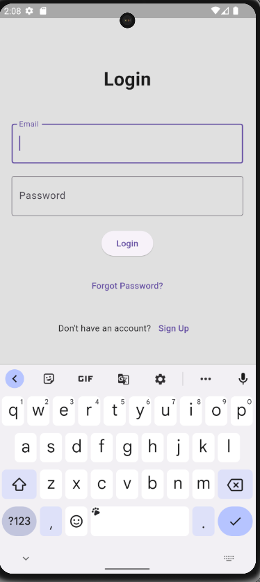

# ODD JOBBER PROJECT

## Description
A simple android app that based on flutter and dart. This app is a simple job finder app. It has a simple UI and UX. It has a simple login and register system. It has a simple job posting system. It has a simple job searching system. It has a simple job applying system. It can be used to hire or find a job.

## Features
- Simple UI and UX
- Simple login and register system
- Simple job posting system
- Simple job searching system
- Simple job applying system
- Can be used to hire or find a job

## How to use
- Clone this repository
- Open this project in Android Studio
- Run this project in Android Studio

## Screenshots

## Author
- [Mejanur Rahman](https://www.github.com/mrmezan06)

## License
This project is licensed under the MIT License - see the [LICENSE](LICENSE) file for details

## Acknowledgments
- [Flutter](https://flutter.dev/)
- [Dart](https://dart.dev/)
- [Android Studio](https://developer.android.com/studio)
- [Firebase](https://firebase.google.com/)
- [Google Fonts](https://fonts.google.com/)
- [Font Awesome](https://fontawesome.com/)
- [Stack Overflow](https://stackoverflow.com/)
- [Youtube](https://www.youtube.com/)
- [Google](https://www.google.com/)
- [Facebook](https://www.facebook.com/)
- [Instagram](https://www.instagram.com/)
- [Twitter](https://twitter.com/)
- [LinkedIn](https://www.linkedin.com/)
- [Reddit](https://www.reddit.com/)
- [Wikipedia](https://www.wikipedia.org/)
- [Medium](https://medium.com/)
- [Quora](https://www.quora.com/)
- [Udemy](https://www.udemy.com/)
- [Udacity](https://www.udacity.com/)
- [Coursera](https://www.coursera.org/)
- [SoloLearn](https://www.sololearn.com/)
- [GeeksforGeeks](https://www.geeksforgeeks.org/)
- [W3Schools](https://www.w3schools.com/)
- [Tutorialspoint](https://www.tutorialspoint.com/index.htm)
- [Codecademy](https://www.codecademy.com/)
- [Programiz](https://www.programiz.com/)
- [DevDocs](https://devdocs.io/)
- [DevHints](https://devhints.io/)
- [Dev](https://dev.to/)
